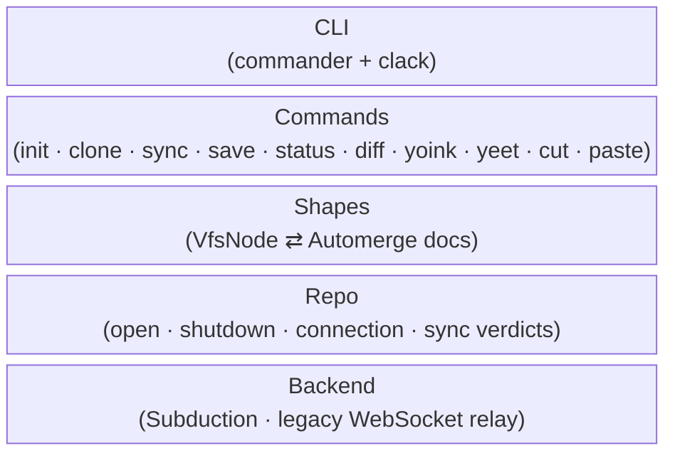

# Pushwork Design

This directory contains design documents for pushwork: how a directory tree is mapped onto Automerge documents, how sync verdicts are reached, and how local state is managed.

## Documents

| Document | Purpose |
| --- | --- |
| [`shapes`](./shapes.md) | The Shape abstraction: encoding a directory tree as docs |
| [`sync`](./sync.md) | Sync flow, server sync verdicts (SYNCED / PENDING) |
| [`artifacts`](./artifacts.md) | Universal heads-pinned links; `artifact` as a content attribute |
| [`config`](./config.md) | Versioned config and stepwise migrations |
| [`snarf`](./snarf.md) | Offline stash: `cut` / `paste` / `snarfs` |

## Layers



## Core Model

Every pushwork repo is a tree of Automerge documents rooted at a single folder document, addressed by a shareable `automerge:` URL:

```
automerge:<root>                      ← the repo's identity (only bare URL)
  ├── folder doc "src"      (heads-pinned link)
  │     ├── file doc "cli.ts"   (heads-pinned link)
  │     └── file doc "repo.ts"  (heads-pinned link)
  ├── folder doc "dist"     (heads-pinned link)
  │     └── file doc "cli.js"   (heads-pinned link)
  └── file doc "README.md"  (heads-pinned link)
```

Every link is pinned at heads, so each URL names an exact published version
and doubles as the next sync's merge base (see [artifacts](./artifacts.md)).

Sync is a decode → reconcile → encode cycle:

1. _Decode_ the tree (via the configured [shape](./shapes.md)) into an in-memory `VfsNode` tree; the pinned links give the base content.
2. _Reconcile_ against the working directory (three-way, with the pin as base; atomic writes).
3. _Encode_ the re-pinned tree back into documents and wait for the [server sync verdict](./sync.md).

## Design Principles

- **Shapes are pluggable** — the document layout is a strategy, not a hardcoded schema; `patchwork-folder` (the default) interoperates with Patchwork.
- **The CRDT is the merge** — no conflict resolution UI; concurrent edits converge via Automerge.
- **Honest verdicts** — the CLI only prints SYNCED when the server has demonstrably received our changes; otherwise PENDING.
- **Immutability in the link layer** — every published link pins heads in the URL, so references are exact versions, not moving targets.
- **Strict config versioning** — unknown config versions hard-error and point at `pushwork migrate`; migrations are small stepwise transforms.
- **Offline-first** — `save`, `status`, `diff`, `heads`, `cut`/`paste` all work without a network connection.
