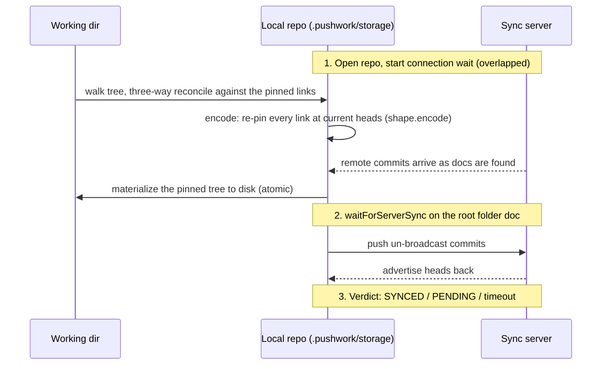

# Sync

## Flow

`pushwork sync` is a commit + reconcile against the sync server:



Key properties:

- `repo.find` is what triggers delivery — every file leaf is touched so the network layer announces it to peers.
- The connection wait (`waitForConnection`) starts immediately after `openRepo` so local tree work overlaps the Subduction handshake.
- Big fresh clones/ingests shard across worker threads (`ingest-pool.ts`) past a size threshold.

## The pinned link is the merge base

Every link in a folder doc is heads-pinned (see [artifacts](./artifacts.md)),
and sync maintains the invariant that **at rest, disk == the content at the
pinned URLs**: sync and `save` pin at the heads they just materialized,
`clone` materializes the published tree, `init` pins what it read off disk.
So the heads already in each link are a deterministic three-way merge base —
no snapshot file, and the arrangement self-heals because every sync
re-anchors the pins to what it wrote to disk.

`pushFiles` reconciles each path as: **base** = the pinned link's content
(what `readFileBytes` decodes, by construction), **disk** = the working-tree
bytes, **tip** = the live doc (heads stripped):

| Case | Action |
| --- | --- |
| disk == base | Nothing to record; re-pin at the tip, so an edit that arrived in local storage (e.g. from the browser) gets published and materialized. |
| tip == disk | The edit is already in the doc (our own earlier merge, or a peer wrote the same bytes): skip the write, just re-pin. Recording it again at the base would land the identical splice twice — Automerge does not dedupe concurrent duplicates. |
| tip == base | A plain local edit: `applyFileEntry` at the tip. |
| all three differ | `handle.changeAt(baseHeads, ...)`: the callback sees the doc *at base*, so the disk diff lands as a change **concurrent** with the tip's, and the two merge instead of the disk diff undoing the tip's edits. |
| link has no heads | Pre-fork repo, no base: `applyFileEntry` at the tip (old behaviour). The first sync pins every link, so this runs once per repo. |

Deletes and creates are unchanged: present in base but gone from disk is a
delete, on disk but absent from base is a create. After the reconcile:
encode (re-pin), stamp, one `waitForServerSync`, final decode, materialize —
leaving base == tip == pin == disk.

Two consequences, stated as behaviour rather than bugs:

- **Syncing publishes the tip it can see**, including a peer's unpublished
  edits that already reached local storage.
- **Folder-doc link updates are last-writer-wins** (`d.docs` is replaced
  wholesale), so two peers syncing concurrently race and one set of pins
  shadows the other on disk until the next sync re-pins the merged file-doc
  tips. Nothing is lost — the file docs merged — but convergence can take an
  extra round.

## The Sync Verdict

The CLI must not claim SYNCED unless the server demonstrably has our data. `syncVerdict` (in `repo.ts`) judges against the _server's_ advertised state, not a local-settle heuristic:

| Condition | Meaning |
| --- | --- |
| _local-quiet_ | Our heads haven't changed for `idleMs` (local writes flushed) |
| _pull-complete_ | We hold every commit the server advertised (`containsHeads`) |
| _push-confirmed_ | The server advertised our current frontier back to us |

```
SYNCED  = local-quiet ∧ pull-complete ∧ push-confirmed
PENDING = local-quiet ∧ pull-complete ∧ ¬push-confirmed
```

> [!NOTE]
>
> Server heads are Subduction _sedimentree_ heads (loose-commit and fragment-boundary ids), NOT the Automerge frontier — they are never compared to `handle.heads()` for equality. Pull-completeness asks "do we already contain everything advertised?"; push-confirmation asks "is our frontier a subset of what the server advertises?".

### Known false negative

A server that compacts our change into a fragment may re-advertise it under a different id, so push-confirmation fails and the CLI shows PENDING even though the data landed. This is deliberate — a conservative false-PENDING replaced the old false-SYNCED. Only a server-ack (`awaitSynced()`-style) API in automerge-repo closes the gap completely.

### Stuck-doc nudge

If we're behind for `resyncAfterMs` (default 6 s) and the scheduler isn't catching us up, `waitForServerSync` re-arms a single fresh sync round via `repo.resyncSubduction(documentId)` — once per document per run (`claimResync`).

## Backends

| Backend | Selection | Verdict basis |
| --- | --- | --- |
| Subduction (default) | unflagged | server-advertised heads (above) |
| Legacy WebSocket relay | `--legacy`/`--no-sub` | local head-stability settle only |

The backend is persisted per-repo in the config; both share the same `automerge-repo` API surface.

## Offline Commands

`save`, `status`, `diff`, `heads`, `cut`/`paste`, and `nuclearizeRepo` open the repo offline (`openRepo(..., { offline: true })`) and never contact the server; the next online `sync` publishes whatever they produced.
